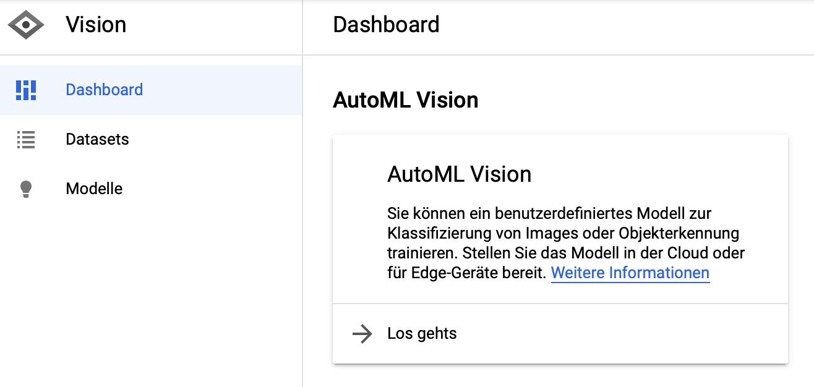
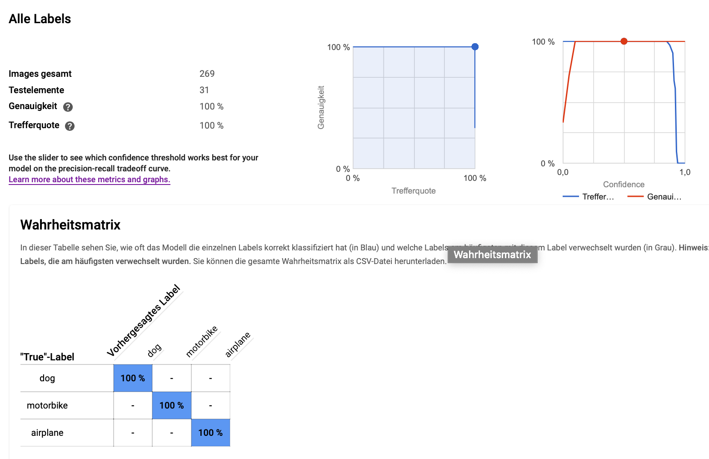
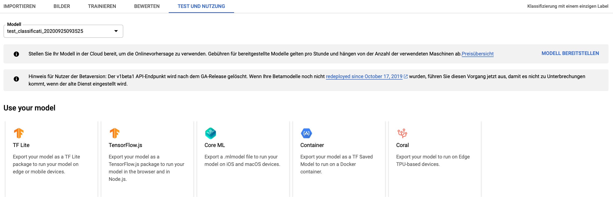

# Using Google AutoML Vision saved_model.pb (exported tensorflow model) within java

### Showcase
I built a tensorflow model with Google AutoMl Vision , downloaded it for local use und wrote a java showcase to execute it:

The showcase processes all images (jpg,png,gif) in the given directory (--scanDir) - the used model is saved in the jar and will be copied to the given directory (--temp).

#### Usage:
java -jar --temp /tmp/model --scanDir /dirContainingPics 

jar is compatible to run on Mac, Windows and Linux

#### Hints:
The model has been trained to classify following classes: motorbike, airplane, dog
The model is only a showcase and is not intended to be a good model.

### Example output:
```
OK   tenor.gif -> {motorbike=0.03536664, airplane=0.03536664, dog=0.92926675} -> dog
OK   dog_PNG50388.png -> {motorbike=0.050735015, airplane=0.1696087, dog=0.7796563} -> dog
OK   Ì.jpg -> {motorbike=0.034807786, airplane=0.06581213, dog=0.8993801} -> dog
```

### Google AutoMl Vision


### Model quality


### Model export ["Export your model as a TF Saved Model to run on a Docker container." or with this showcase in java ;-)]



